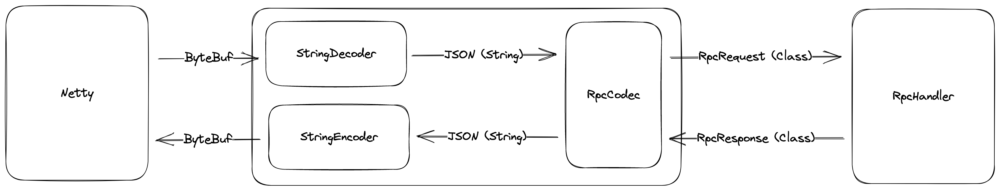

# 手写 Java RPC（基于 Netty 的最简单版 RPC）



## How to use

### Server 

```java
@Log
public class ServerApplication {
    public static void main(String[] args) throws Exception {
        RpcServer server = new RpcServer(8080);

        // optional
        server.addMiddlewares(new JdkLogMiddleware());

        // optional
        server.registerServices(Map.of(
                "Hello", (req, resp) -> {
                    log.info("Hello World!!!");
                    resp.setCode(0);
                },
                "Demo", new DemoService()::demo
        ));
        
        server.run();
    }
}
```

### Client

```java
public class ClientApplication {
    public static void main(String[] args) throws Exception {
        RpcClient client = new RpcClient("localhost", 8080);
        RpcRequest<String> req = new RpcRequest<>("Hello", "No data");
        RpcResponse<?> resp = client.call(req);
        System.out.println(resp);
        client.shutdown();
    }
}
```

## 详细设计

RPC 分为 Transport、Protocol、Processor 层，其中 Transport 层负责网络传输、Protocol 层负责网络字节流的序列化与反序列化、Processor 层负责服务调用

### Transport 层

使用 Netty 作为 Transport 层的解决方案，在 `org.example.server.RpcServer` 中的 `run` 方法中封装了 Netty 官网的 Example 中的代码

### Protocol 层

使用最简单的 JSON 格式来传输数据，先通过 Netty 的 `StringDecoder` 与 `StringEncoder` 让 `ByteBuf`（通过网络传输的字节数组）读/写为字符串，并在 `RpcCodec` 中使用 Jackson 进行 JSON 的序列化/反序列化

### Processor 层

抽象 RPC 服务为一个函数式接口（方便使用 Lambda 表达式）

```java
@FunctionalInterface
public interface RpcService extends BiConsumer<RpcRequest<?>, RpcResponse<?>> {
}
```

并设计了 `ServiceRegistry` 服务注册单例组件，负责本地的服务注册

## 扩展能力

### Middleware 中间件

支持在调用服务的前后可以进行一些 Hook 调用

```java
@FunctionalInterface
public interface RpcMiddleware {
    RpcService apply(RpcService service);
}
```

例如，在方法调用的前后进行日志的记录：

```java
@Log
public class JdkLogMiddleware implements RpcMiddleware {
    @Override
    public RpcService apply(RpcService service) {
        return (req, resp) -> {
            log.info(String.format("Request:  %s", req.toString()));
            service.accept(req, resp);
            log.info(String.format("Response: %s", resp.toString()));
        };
    }
}
```
